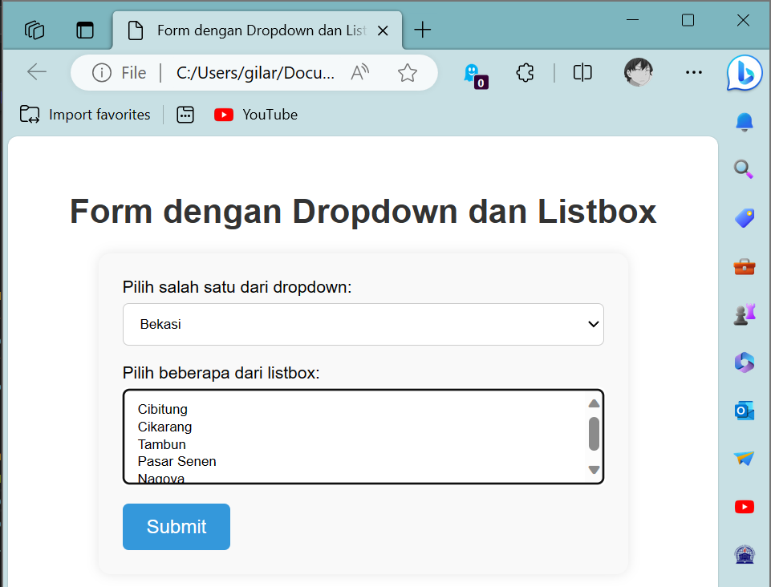
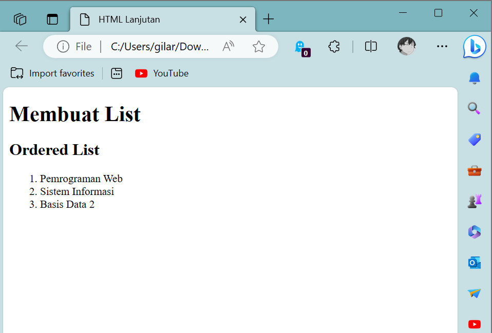
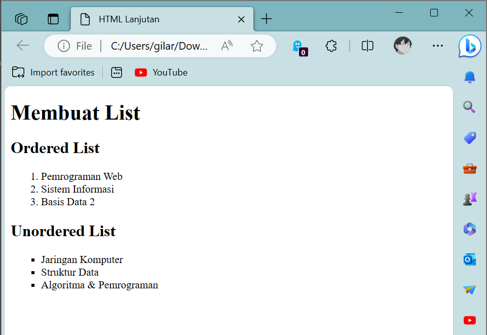
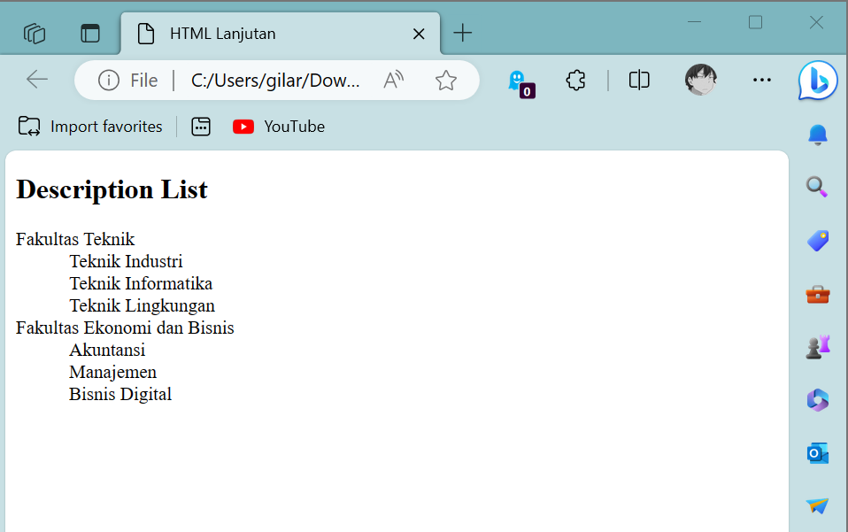
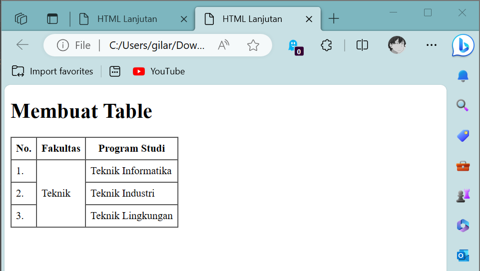
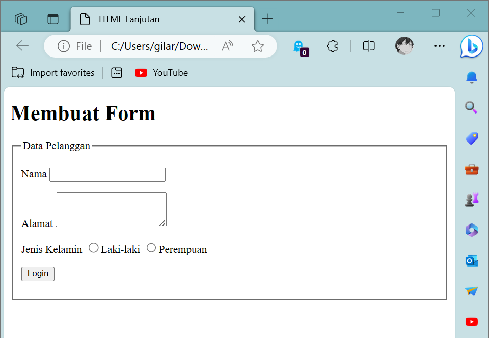
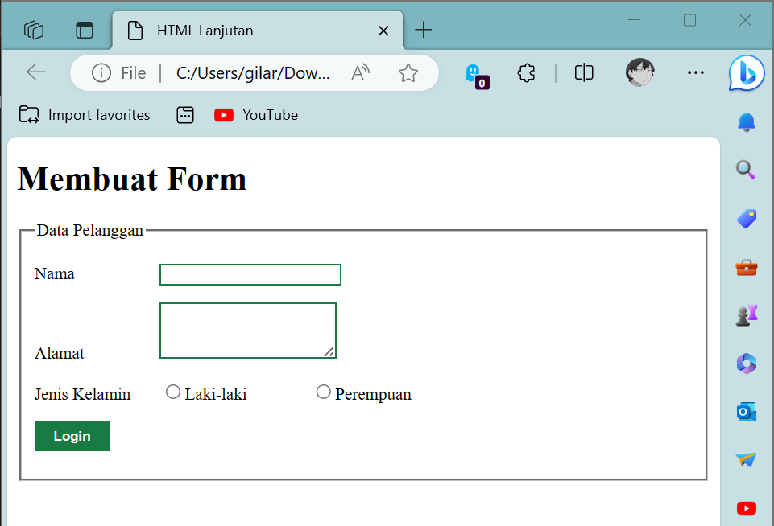

# Membuat List, Table dan Form
## Profil
| Variable | Isi |
| -------- | --- |
| **Nama** | Gilar Sumilar |
| **NIM** | 312210407 |
| **Kelas** | TI.22.A4 |
| **Mata Kuliah** | Pemrograman WEB |

### Tugas
1. Buatlah repository baru dengan nama Lab3Web.
2. Kerjakan semua latihan yang diberikan sesuai urutannya.
3. Screenshot setiap perubahannya.
4. Buatlah file README.md dan tuliskan penjelasan dari setiap langkah praktikum beserta
screenshotnya.
5. Commit hasilnya pada repository masing-masing.
6. Kirim URL repository pada e-learning ecampus

### Tugas +
1. Buatlah form yang menampilkan dropdown menu dan listbox dengan multiple selection.

[Sourcecode](https://github.com/GilarSumilar/Lab3Web/blob/main/Dropdown%20%26%20Listbox.html)

**Hasil tugas :**
   

## 1. Membuat Ordered List
```HTML
<!DOCTYPE html>
<html lang="en">

<head>
    <meta charset="UTF-8">
    <meta name="viewport" content="width=device-width, initial-scale=1.0">
    <title>HTML Lanjutan</title>
</head>

<body>
    <header>
        <h1>Membuat List</h1>
    </header>
    <section id="order-list">
        <h2>Ordered List</h2>
        <ol>
            <li>Pemrograman Web</li>
            <li>Sistem Informasi</li>
            <li>Basis Data 2</li>
        </ol>
    </section>
</body>

</html>
```
**Hasil :**



#### *Note :*
- Ordered List

  Digunakan untuk membuat daftar dimana tiap bagiannya ditandai dengan sebuah simbol. 
  Ordered list dibuat dengan tag `<ol>`. Lalu di dalamnya di isi dengan item-item yang akan dimasukkan ke
  dalam list. Item dibuat dengan tag `<li>` (list item).

## 2. Membuat Unorderd List
```HTML
<!DOCTYPE html>
<html lang="en">

<head>
    <meta charset="UTF-8">
    <meta name="viewport" content="width=device-width, initial-scale=1.0">
    <title>HTML Lanjutan</title>
</head>

<body>
    <header>
        <h1>Membuat List</h1>
    </header>
    <section id="order-list">
        <h2>Ordered List</h2>
        <ol>
            <li>Pemrograman Web</li>
            <li>Sistem Informasi</li>
            <li>Basis Data 2</li>
        </ol>
    </section>
    <section id="unorder-list">
        <h2>Unordered List</h2>
        <ul type="square">
            <li>Jaringan Komputer</li>
            <li>Struktur Data</li>
            <li>Algoritma &amp; Pemrograman</li>
        </ul>
    </section>
</body>

</html>
```
**Hasil :**



#### *Note :*


## 3. Membuat Description List
```HTML
<!DOCTYPE html>
<html lang="en">

<head>
    <meta charset="UTF-8">
    <meta name="viewport" content="width=device-width, initial-scale=1.0">
    <title>HTML Lanjutan</title>
</head>

<body>
    <section id="unorder-list">
        <h2>Description List</h2>
        <dl>
            <dt>Fakultas Teknik</dt>
            <dd>Teknik Industri</dd>
            <dd>Teknik Informatika</dd>
            <dd>Teknik Lingkungan</dd>
            <dt>Fakultas Ekonomi dan Bisnis</dt>
            <dd>Akuntansi</dd>
            <dd>Manajemen</dd>
            <dd>Bisnis Digital</dd>
        </dl>
    </section>
</body>

</html>
```
**Hasil :**



#### *Note :*


## 4. Membuat Tabel
```HTML
<!DOCTYPE html>
<html lang="en">

<head>
    <meta charset="UTF-8">
    <meta name="viewport" content="width=device-width, initial-scale=1.0">
    <title>HTML Lanjutan</title>
</head>

<body>
    <header>
        <h1>Membuat Table</h1>
    </header>

    <table border="1" cellpadding="4" cellspacing="1">
        <thead>
            <tr>
                <th>No.</th>
                <th>Fakultas</th>
                <th>Program Studi</th>
            </tr>
        </thead>
        <tbody>
            <tr>
                <td>1.</td>
                <td>Teknik</td>
                <td>Teknik Informatika</td>
            </tr>
            <tr>
                <td>2.</td>
                <td>Teknik</td>
                <td>Teknik Industri</td>
            </tr>
            <tr>
                <td>3.</td>
                <td>Teknik</td>
                <td>Teknik Lingkungan</td>
            </tr>
        </tbody>
    </table>

</body>

</html>
```
**Hasil :**


#### *Note :*
- Di sini saya mencoba untuk meurubah margin dan padding pada cel data.
- Mengatur Margin dan Padding

  Untuk mengatur margin dan padding pada cel data, tambahkan atribut cellpadding dan
  cellspacing pada tag table.
  
  ```CSS
  <table border="1" cellpadding="4" cellspacing="0">
  ```
## 5. Menggabungkan Sel Data
```HTML
<!DOCTYPE html>
<html lang="en">

<head>
    <meta charset="UTF-8">
    <meta name="viewport" content="width=device-width, initial-scale=1.0">
    <title>HTML Lanjutan</title>
</head>

<body>
    <header>
        <h1>Membuat Table</h1>
    </header>

    <table border="1" cellpadding="6" cellspacing="0">
        <thead>
            <tr>
                <th>No.</th>
                <th>Fakultas</th>
                <th>Program Studi</th>
            </tr>
        </thead>
        <tbody>
            <tr>
                <td>1.</td>
                <td rowspan="3">Teknik</td>
                <td>Teknik Informatika</td>
            </tr>
            <tr>
                <td>2.</td>
                <td>Teknik Industri</td>
            </tr>
            <tr>
                <td>3.</td>
                <td>Teknik Lingkungan</td>
            </tr>
        </tbody>
    </table>

</body>

</html>
```
**Hasil :**



#### *Note :*
Untuk menggabungkan sel data, gunakan atribut rowspan dan colspan. Atribut rowspan untuk
menggabungkan baris (secara vertikal) dan colspan untuk menggabungkan kolom (secara
horizontal).


## 6. Membuat Form
```HTML
<!DOCTYPE html>
<html lang="en">

<head>
    <meta charset="UTF-8">
    <meta name="viewport" content="width=device-width, initial-scale=1.0">
    <title>HTML Lanjutan</title>
</head>

<body>
    <header>
        <h1>Membuat Form</h1>
    </header>

    <form action="proses.php" method="post">
        <fieldset>
            <legend>Data Pelanggan</legend>
            <p>
                <label for="nama">Nama</label>
                <input type="text" id="nama" name="nama">
            </p>
            <p>
                <label for="alamat">Alamat</label>
                <textarea id="alamat" name="alamat" cols="20" rows="3"></textarea>
            </p>
            <p>
                <label>Jenis Kelamin</label>
                <input id="jk_l" type="radio" name="kelamin" value="L" /><label for="jk_l">Laki-laki</label>
                <input id="jk_p" type="radio" name="kelamin" value="P" /><label for="jk_p">Perempuan</label>
            </p>
            <p><input type="submit" value="Login"></p>
        </fieldset>
    </form>

</body>

</html>
```

**Hasil :**



#### *Note :*

## 7. Menabahkan Style pada Form
```HTML
<!DOCTYPE html>
<html lang="en">

<head>
    <meta charset="UTF-8">
    <meta name="viewport" content="width=device-width, initial-scale=1.0">
    <title>HTML Lanjutan</title>

    <style>
        form p>label {
            display: inline-block;
            width: 100px;
        }

        form input[type="text"],
        form textarea {
            border: 1.5px solid #197a43;
        }

        form input[type="submit"] {
            border: 1px solid #197a43;
            background-color: #197a43;
            color: #ffffff;
            font-weight: bold;
            padding: 5px 15px;
        }
    </style>

</head>

<body>
    <header>
        <h1>Membuat Form</h1>
    </header>

    <form action="proses.php" method="post">
        <fieldset>
            <legend>Data Pelanggan</legend>
            <p>
                <label for="nama">Nama</label>
                <input type="text" id="nama" name="nama">
            </p>
            <p>
                <label for="alamat">Alamat</label>
                <textarea id="alamat" name="alamat" cols="20" rows="3"></textarea>
            </p>
            <p>
                <label>Jenis Kelamin</label>
                <input id="jk_l" type="radio" name="kelamin" value="L" /><label for="jk_l">Laki-laki</label>
                <input id="jk_p" type="radio" name="kelamin" value="P" /><label for="jk_p">Perempuan</label>
            </p>
            <p><input type="submit" value="Login"></p>
        </fieldset>
    </form>

</body>

</html>
```
**Hasil :**



#### *Note :*
```CSS
<style>
        form p>label {
            display: inline-block;
            width: 100px;
        }

        form input[type="text"],
        form textarea {
            border: 1.5px solid #197a43;
        }

        form input[type="submit"] {
            border: 1px solid #197a43;
            background-color: #197a43;
            color: #ffffff;
            font-weight: bold;
            padding: 5px 15px;
        }
    </style>
```
File CSS yg di tambahkan agar tampilan form lebih menarik, bisa ditambahkan CSS seperti berikut.
